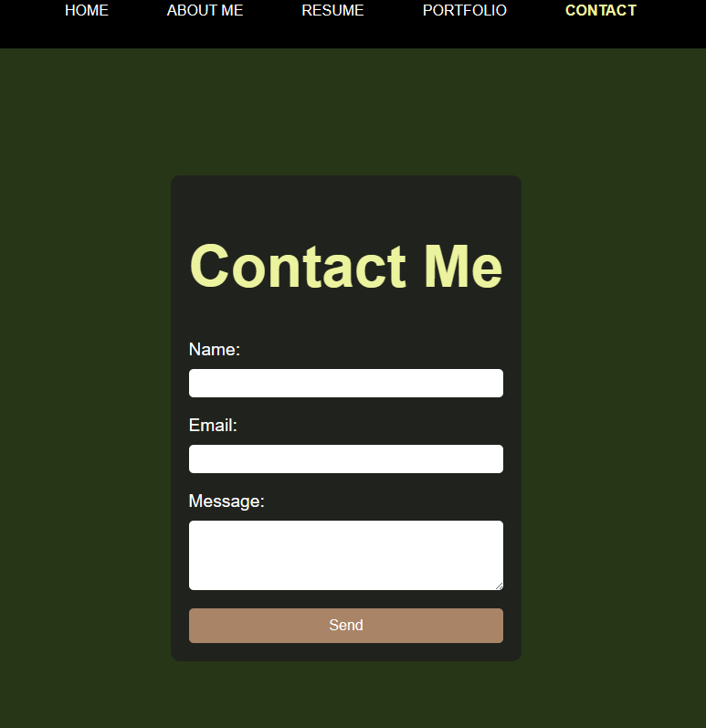

# React-Portfolio

## Table of Contents
- [Overview](#overview)
- [Installation](#installation)
- [Usage](#usage)
- [Features](#features)
- [Assets](#assets)
- [License](#license)

### Overview
This portfolio website is built using React and styled-components. It consists of multiple pages, including:

- Home: Displays a welcome message and an image of Ashley Paluzzi.
- About: Provides information about Ashley, including her background, skills, and expertise.
- Resume: Displays Ashley's resume, showcasing her education, work experience, and skills.
- Portfolio: Showcases Ashley's projects, including links to deployed apps and GitHub repositories.
- Contact: Allows visitors to contact Ashley by filling out a form.

### Installation
- Clone the repository to your local machine: `git clone <repository-url>`
- Navigate to the project directory: `cd <project-directory>`
- Install dependencies: `npm install`

### Usage
To run the project locally:
- Start the development server: `npm start`

Open your browser and visit http://localhost:3000 to view the website.

### Features
- Navigation menu for easy navigation between pages.
- Responsive design for optimal viewing on various devices.
- Form validation on the Contact page to ensure all fields are filled out correctly before submission.

### Assets

### License
This project is licensed under the MIT License.
